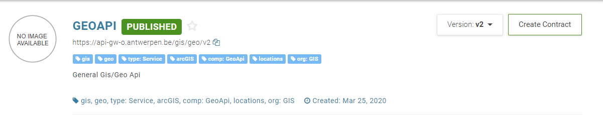

# Location Viewer Smart Widget UI (Angular)

The Location Viewer Smart Widget UI provides an easy to use interface for displaying locations or addresses within the city of Antwerp.

This library was tested in Angular 8.


## Using the component

### Installation

First install the component from npm:

`npm install @acpaas-ui-widgets/ngx-location-viewer`

Then import the component inside your module:

```ts
import {LocationViewerModule} from '@acpaas-ui-widgets/ngx-location-viewer';

@NgModule({
  imports: [
    ...,
    LocationViewerModule
  ],
  ...
})
```

Finally include the required styles:

Add Antwerp core branding stylesheet in your index.html file:

```html
<link rel="stylesheet" href="https://cdn.antwerpen.be/core_branding_scss/4.1.1/main.min.css">
```

Add required leaflet styles in your angular.json file.

```
"styles": [
    "node_modules/leaflet/dist/leaflet.css",
    "node_modules/leaflet-draw/dist/leaflet.draw.css",
    "node_modules/@geoman-io/leaflet-geoman-free/dist/leaflet-geoman.css",
    "node_modules/leaflet.markercluster/dist/MarkerCluster.Default.css",
    "node_modules/leaflet.markercluster/dist/MarkerCluster.css"
]
```
Next, you will need to configure your BFF to proxy all Geo API request to the correct service.

The concept remains the same for different technologies:

The BFF should function solely as a pass-through layer where the API KEY gets added to the request header before proxying.

Create a contract with the "GEOAPI" on the api-store


### Usage
```html
<aui-location-viewer
    ...
    (filteredResult)="onfilteredResult($event)"
></aui-location-viewer>
```

**Minimal example**
```html
<aui-location-viewer></aui-location-viewer>
```


**Full example**
```html
<aui-location-viewer
    [geoApiBaseUrl]="geoApiBaseUrl"
    [defaultZoom]="defaultZoom"
    [mapCenter]="mapCenter"
    [hasSidebar]="hasSidebar"
    [showLayerManagement ]="showLayerManagement"
    [showSelectionTools]="showSelectionTools"
    [showMeasureTools]="showMeasureTools"
    [showWhatIsHereButton]="showWhatIsHereButton"
    [supportingLayerOptions]="supportingLayerOptions"
    [operationalLayerOptions]="operationalLayerOptions"
    [filterLayers]="filterLayers"
    [leafletMap]="leafletMap"
    [defaultTileLayerLabel]="defaultTileLayerLabel"
    [tileLayer]="tileLayer"
    (addPolygon)="onAddPolygon($event)"
    (addLine)="onAddLine($event)"
    (editFeature)="onEditFeature($event)"
    (hasSidebarChange)="onHasSidebarChange($event)"
    (filteredResult)="onFilteredResult($event)"
>

<p>This is shown inside the leaflet sidebar if hasSidebar is set to true.</p>

</aui-location-viewer>
```

**Explanation layer types**

* Operational layer
Operational layer is the main layer of the location viewer widget. After you have provided the setting to build this layer it is possible to filter this layer with selection tools (rectangle, polygon and filterlayer). After each selection the location viewer widget will push the filtered results of the layer.
This layer will be initialized in ngOnInit with settings passed through the operationalLayerOptions input param. There are 2 possible ways to build this layer:
  * Mapserver (provide url (valid mapserver url) and layerid properties)
  * Markers (provide markers, isVisible and name properties)
* Supporting layer
Supporting layer is only there to visualize certain objects in leaflet. This layer will be initialized in ngOnInit with settings passed through the supportingLayerOptions input param.
* Filter layers
Filter layers are used to filter the operational layer by a specific object that is a polygon. After clicking on this layer the operational layer will be filtered by the objects geometry. This layer will be initialize in ngOnInit with settings passed through the filterLayerOptions input param.

For working examples of the layer types check [demo](##demo), this is a working page with a form to test all the possible parameters.

```ts
class ExampleComponent {

    /* Url to the backend-for-frontend (bff) Should function as pass through to the Geo API. */
    @Input() geoApiBaseUrl: string;
    /* The default zoom level on map load. */
    @Input() defaultZoom = 14;
    /* The initial map center on load. */
    @Input() mapCenter: Array<number> = [51.215, 4.425];
    /* Show a sidebar next to the map leaflet. A sidebar can contain any additional info you like. */
    @Input() hasSidebar = false;
    /* Shows layermangement inside the sidebar. Layermanagement is used to add or remove featurelayers. */
    @Input() showLayerManagement = true;
    /* Show selection tools */
    @Input() showSelectionTools = true;
    /* Show measure tools */
    @Input() showMeasureTools = true;
    /* show whatishere button */
    @Input() showWhatIsHereButton = true;
    /* Add supporting layers. If provided will be added as DynamicMapLayer to leaflet */
    @Input() supportingLayerOptions: SupportingLayerOptions;
    /* Add operationalLayer. If provided will be added as FeaturLayer(clustered) to leaflet */
    @Input() operationalLayerOptions: OperationalLayerOptions;
    /* Adds filter layer. If provided will be added as FeatureLayer to leaflet. Is used to filter operationallayer by geometry */
    @Input() filterLayers: FilterLayerOptions[];
    /* Leafletmap instance. If null will be initialized .*/
    @Input() leafletMap: LocationViewerMap;
    /* Default tile layer button label */
    @Input() defaultTileLayerLabel = 'Kaart';
    /* Custom leaflet tile layer, if provided, shows actions on the leaflet to toggle between default and custom tile layer. */
    @Input() tileLayer: LeafletTileLayerModel;
    /* HasSideBar change */
    @Output() hasSidebarChange = new EventEmitter<boolean>();
    /* AddPolygon event */
    @Output() addPolygon = new EventEmitter<any>();
    /* AddLine event */
    @Output() addLine = new EventEmitter<any>();
    /* EditFeature event */
    @Output() editFeature = new EventEmitter<any>();
    /* Operational layer filtered: fired when using selection tools rectangle/polygon, using filter layer or clicking on marker of operational layer. */
    @Output() filteredResult = new EventEmitter<GeofeatureDetail[] | OperationalMarker[] | any>();

}
```

## Demo

Live demo can be found on:
https://locationviewerweb-o.antwerpen.be/

You can also choose to test it locally:

In the root directory run:
```
npm install && ng build ngx-location-viewer && ng serve
```

This will install all required dependencies, create an optimized build for the location picker library and sets up a local server at http://localhost:4200.

## Local development

Install required dependencies:
```
npm install
```

Rebuild library on changes
```
npm run dev
```

Start example project
```
ng serve
```

Any changes done on the library will visible on http://localhost:4200

## Support

Jasper Van Proeyen (<jasper.vanproeyen@digipolis.be>)

## Publishing

> Only the ACPaaS UI team publishes new packages. [Contact us](https://acpaas-ui.digipolis.be/contact) if you need a new release published.

## Running unit tests

Run `ng test ngx-location-viewer` to execute the unit tests via [Karma](https://karma-runner.github.io).

## Further help

To get more help on the Angular CLI use `ng help` or go check out the [Angular CLI README](https://github.com/angular/angular-cli/blob/master/README.md).
